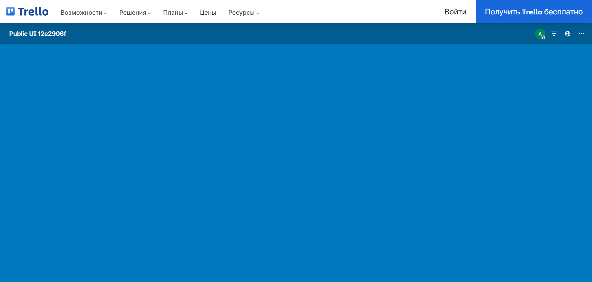

# Дипломный проект: автоматизация тестирования Trello

**Автор:** shadow7971247  
**Объект:** [Trello](https://trello.com) — веб и Android-приложение Atlassian  
**Allure TestOps:** [проект #592](https://allure.autotests.cloud) · `shadow7971247_trello`

Три репозитория образуют экосистему **API-first**: API готовит данные, UI проверяет публичный веб, mobile — native-приложение на эмуляторе и в BrowserStack.

---

## :link: Репозитории

| Проект | GitHub | Роль | Тестов |
|--------|--------|------|--------|
| **trello_api** | [trello_api](https://github.com/shadow7971247/trello_api) | REST CRUD, auth, публичные доски для UI | 25 |
| **trello_ui** | [trello_ui](https://github.com/shadow7971247/trello_ui) | Read-only веб на публичных URL (без логина) | 11 |
| **trello_mobile** | [trello_mobile](https://github.com/shadow7971247/trello_mobile) | Appium: локальный эмулятор и BrowserStack | 8 |

**Порядок прогона:** API → UI → Mobile.

---

## :page_facing_up: Содержание

1. [Цель](#цель)
2. [Архитектура](#архитектура)
3. [Технологии](#технологии)
4. [Проекты](#проекты)
5. [CI и TestOps](#ci-и-testops)
6. [Отчётность Allure](#отчётность-allure)
7. [Скриншоты](#скриншоты)
8. [Запуск](#запуск)

---

## :dart: Цель

| Задача | Решение |
|--------|---------|
| Тестовые данные | `trello_api` — boards, lists, cards, checklists, members |
| Стабильный веб | `trello_ui` — публичные доски по URL, без логина в браузере |
| Mobile | `trello_mobile` — workspace, deep link, CRUD в приложении |
| Облачный mobile | BrowserStack App Automate (Pixel 8 / Android 14) |
| Отчёты | Allure: HTTP JSON, скрины на шагах, видео Selenoid / BrowserStack |

---

## :building_construction: Архитектура

```
                    ┌─────────────────────────────────┐
                    │   Allure TestOps #592            │
                    └───────────────┬─────────────────┘
                                    │
         ┌──────────────────────────┼──────────────────────────┐
         │                          │                          │
  ┌──────▼──────┐           ┌───────▼──────┐           ┌───────▼──────┐
  │ trello_api  │           │  trello_ui   │           │trello_mobile │
  └──────┬──────┘           └───────┬──────┘           └───────┬──────┘
         │                          │                          │
         └──────────────────────────┼──────────────────────────┘
                                    ▼
                         Trello Cloud (REST + публичные доски)
                                    ▲
                                    │
                         BrowserStack (APK Trello 2024.7.3)
```

---

## :hammer_and_wrench: Технологии

| Python | Selenium | Pytest | Appium | Jenkins |
|--------|----------|--------|--------|---------|
|  |  |  |  |  |

| Allure | Requests | Pydantic | BrowserStack | Selenoid |
|--------|----------|----------|--------------|----------|
|  |  |  |  |  |

---

## Проекты

### trello_api

Поставщик данных: REST CRUD, auth, `prepare_public_board` для UI.

- **Стек:** Python, requests, Pydantic v2, pytest, Allure  
- **Маркеры:** `smoke`, `auth`, `boards`, `cards`, `lists`, `checklists`, `members`  
- **Allure:** HTTP method, endpoint, payload, response JSON  

```bash
cd trello_api && pytest -m smoke --alluredir=allure-results
```

### trello_ui

11 read-only тестов на публичных досках; браузер не логинится.

- **Стек:** Selene, Selenium, Chrome / Selenoid  
- **Page Object:** `BoardPage`, `CardPage`  
- **Allure:** скрин на каждый шаг, финальный скрин, лог браузера, видео Selenoid  

```bash
cd trello_ui && pytest -m ui --alluredir=allure-results
```

### trello_mobile

Native Android: smoke, deep link, CRUD с проверкой через API.

- **Профили:** `--run-context local` · `--run-context browserstack`  
- **BrowserStack:** APK `2024.7.3`, Pixel 8 / Android 14, activity `com.trello.home.HomeActivity`  
- **Allure:** скрины экранов, UI hierarchy (XML), видео BrowserStack  

```bash
cd trello_mobile && pytest -m mobile --run-context local --alluredir=allure-results
cd trello_mobile && pytest -m cloud_smoke --run-context browserstack --alluredir=allure-results
```

---

## CI и TestOps

| Этап | Репозиторий | Команда |
|------|-------------|---------|
| API | `trello_api` | `pytest -m smoke --alluredir=allure-results` |
| UI | `trello_ui` | `pytest -m ui --alluredir=allure-results` |
| Mobile (local) | `trello_mobile` | `pytest -m mobile --run-context local` |
| Mobile (облако) | `trello_mobile` | `pytest -m cloud_smoke --run-context browserstack` |

**Jenkins:** Freestyle, label `python`, параметр `PYTEST_SCOPE`.

**Секреты:** `TRELLO_API_KEY`, `TRELLO_API_TOKEN`, `TRELLO_EMAIL`, `TRELLO_PASSWORD`, `BROWSERSTACK_*`, `ALLURE_TOKEN`.

```bash
allurectl upload --endpoint https://allure.autotests.cloud \
  --token %ALLURE_TOKEN% --project-id 592 \
  --launch-name "trello-%BUILD_NUMBER%" allure-results
```

Прогоны трёх Jenkins-заданий (API, UI, Mobile) попадают в TestOps **#592**. Цепочка отчёта: запуск → suite → тест → шаг → вложение.

---

## :bar_chart: Отчётность Allure

| Проект | Вложения |
|--------|----------|
| **API** | HTTP-запрос и ответ (JSON), результат теста |
| **UI** | Скрин каждого шага, финальный скрин, лог браузера, видео Selenoid |
| **Mobile** | Скрины экранов, иерархия UI (XML), видео BrowserStack |

Локально: `allure serve allure-results`.

---

## :ticket: Скриншоты

### Allure — API (smoke, 7 тестов)


---

### Allure — UI (11 тестов)


---

### UI — публичные доски и карточки

API создаёт публичную доску → браузер открывает URL без логина.

| Доска | Список | Карточка |
|-------|--------|----------|
|  |  |  |

Финальный скрин теста в Allure:



---

### Allure — Mobile (локальный прогон, 6 тестов)


---

### Mobile — эмулятор Android

| Запуск | Главный экран | Экран досок |
|--------|---------------|-------------|
|  |  |  |

---

### Mobile — сценарии автотестов

| Доска в списке | Открытие доски | Deep link |
|----------------|----------------|-----------|
|  |  |  |

| Переименование карточки | Удаление карточки |
|-------------------------|-------------------|
|  |  |

---

## :arrow_forward: Запуск

```bash
# API
cd trello_api && pytest -m smoke --alluredir=allure-results

# UI
cd trello_ui && pytest -m ui --alluredir=allure-results

# Mobile — эмулятор (Appium :4723, adb devices)
cd trello_mobile && pytest -m "mobile and not browserstack" --run-context local --alluredir=allure-results

# Mobile — BrowserStack (CI)
cd trello_mobile && pytest -m cloud_smoke --run-context browserstack --alluredir=allure-results

# Просмотр отчёта
allure serve allure-results
```

---

## :white_check_mark: Итоги

- **44 автотеста** в трёх репозиториях, общий data layer через API.  
- UI стабилен за счёт публичных досок — без логина в браузере.  
- Mobile: локальный эмулятор и BrowserStack, рабочий APK и `HomeActivity`.  
- Allure: скрины на шагах, HTTP-тела, видео облачных прогонов.  
- CI: Jenkins → Allure TestOps #592.
