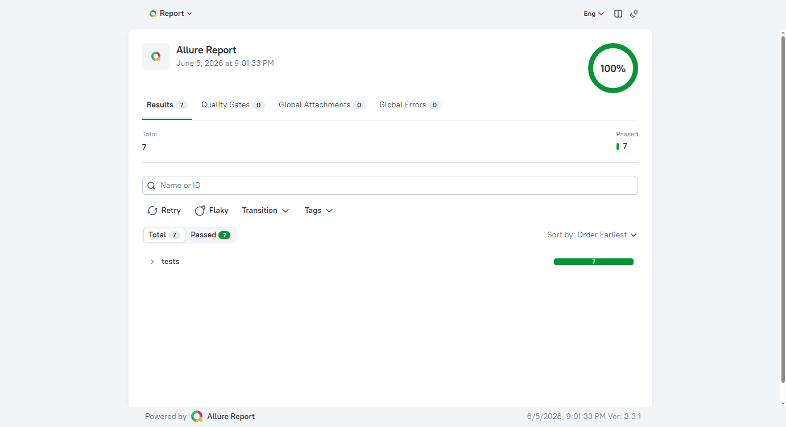

# Дипломный проект: автоматизация тестирования Trello

**Автор:** shadow7971247  
**Объект:** [Trello](https://trello.com) — веб и Android-приложение Atlassian  
**Allure TestOps:** [проект #592](https://allure.autotests.cloud) · `shadow7971247_trello`

Три связанных репозитория образуют **API-first** экосистему QA: API готовит данные, UI проверяет публичный web, mobile — native app в эмуляторе и BrowserStack.

---

## :link: Репозитории

| Проект | GitHub | Роль | Тестов |
|--------|--------|------|--------|
| **trello_api** | [github.com/shadow7971247/trello_api](https://github.com/shadow7971247/trello_api) | REST CRUD, auth, публичные доски для UI | 25 |
| **trello_ui** | [github.com/shadow7971247/trello_ui](https://github.com/shadow7971247/trello_ui) | Read-only web на публичных URL (без логина) | 11 |
| **trello_mobile** | [github.com/shadow7971247/trello_mobile](https://github.com/shadow7971247/trello_mobile) | Appium, local + BrowserStack | 8 |

**Локальная структура:** `trello/trello_api`, `trello/trello_ui`, `trello/trello_mobile`  
**CI и Jenkins:** [docs/CI.md](docs/CI.md) · [docs/JENKINS_FREESTYLE.md](docs/JENKINS_FREESTYLE.md)

---

## :page_facing_up: Содержание

1. [Цель](#цель)
2. [Архитектура](#архитектура)
3. [Технологии](#технологии)
4. [trello_api](#trello_api)
5. [trello_ui](#trello_ui)
6. [trello_mobile](#trello_mobile)
7. [CI / Jenkins / TestOps](#ci--jenkins--testops)
8. [Отчётность Allure](#отчётность-allure)
9. [Скриншоты](#скриншоты)
10. [Запуск для защиты](#запуск-для-защиты)

---

## :dart: Цель

Построить **многоуровневую автоматизацию** Trello с единой отчётностью в Allure TestOps и воспроизводимым CI:

| Задача | Решение |
|--------|---------|
| Тестовые данные | `trello_api` — boards, lists, cards, checklists, members |
| Web без flaky-логина | `trello_ui` — только публичные доски по URL |
| Mobile native | `trello_mobile` — deep link, workspace, CRUD в приложении |
| Облачный mobile | BrowserStack App Automate (Pixel 8 / Android 14) |
| Отчёты | Скриншоты на каждый шаг и тест, HTTP JSON, видео Selenoid/BS |

---

## :building_construction: Архитектура

```
                    ┌─────────────────────────────────┐
                    │   Allure TestOps #592            │
                    │   allure.autotests.cloud         │
                    └───────────────┬─────────────────┘
                                    │
         ┌──────────────────────────┼──────────────────────────┐
         │                          │                          │
  ┌──────▼──────┐           ┌───────▼──────┐           ┌───────▼──────┐
  │ trello_api  │           │  trello_ui   │           │trello_mobile │
  │ requests    │◄─────────►│ Selene + PO  │           │ Appium + SO  │
  │ Pydantic    │  api_bridge│ Chrome/Sel. │           │ BS / local   │
  └──────┬──────┘           └───────┬──────┘           └───────┬──────┘
         │                          │                          │
         └──────────────────────────┼──────────────────────────┘
                                    ▼
                         Trello Cloud (REST + публичные доски)
                                    ▲
                                    │
                         BrowserStack (APK Trello 2024.7.3)
```

**Порядок прогона:** API → UI → Mobile.

---

## :hammer_and_wrench: Технологии

| Python | Selenium | Pytest | Appium | Jenkins |
|--------|----------|--------|--------|---------|
|  |  |  |  |  |

| Allure | Requests | Pydantic | BrowserStack | Selenoid |
|--------|----------|----------|--------------|----------|
|  |  |  |  |  |

---

## trello_api

**Репозиторий:** [github.com/shadow7971247/trello_api](https://github.com/shadow7971247/trello_api)

| | |
|---|---|
| **Назначение** | Data provider: REST CRUD, auth, закрытие досок, `prepare_public_board` для UI |
| **Стек** | Python 3.14+, requests, Pydantic v2, pytest, Allure, Faker |
| **Архитектура** | `api/client.py` → `models/` → `fixtures/generators.py` → `tests/` |
| **Маркеры** | `smoke`, `auth`, `boards`, `cards`, `lists`, `checklists`, `members` |
| **Конфиг** | `.env`: `TRELLO_API_KEY`, `TRELLO_API_TOKEN`, `TRELLO_BASE_URL` |

**Smoke-покрытие (7 тестов):** auth, boards, cards, checklists, lists, members.

**Allure:** epic «Trello API», на каждый HTTP — method, endpoint, payload, status, response JSON.

```bash
cd trello_api
pytest -m smoke --alluredir=allure-results
```

---

## trello_ui

**Репозиторий:** [github.com/shadow7971247/trello_ui](https://github.com/shadow7971247/trello_ui)

| | |
|---|---|
| **Назначение** | 11 read-only тестов на **публичных** досках; браузер не логинится |
| **Стек** | Selene, Selenium, Chrome / Selenoid |
| **Page Object** | `BoardPage`, `CardPage` |
| **Данные** | `api_bridge` → соседний `trello_api` или `TRELLO_API_PATH` |
| **Маркеры** | `ui`, `smoke` |
| **Конфиг** | `trello_ui/.env` — только API key/token |

**Сценарии:**

| Файл | Проверки |
|------|----------|
| `test_public_board` | URL, shortUrl, заголовок вкладки |
| `test_public_lists` | один и несколько списков |
| `test_public_cards` | карточки, скрытие архивной |
| `test_public_card_detail` | карточка по URL, клик с доски |

**Allure:** скрин на каждый `@allure.step`, финальный скрин теста, browser-log, видео Selenoid (в CI).

```bash
cd trello_ui
pytest -m ui --alluredir=allure-results
```

---

## trello_mobile

**Репозиторий:** [github.com/shadow7971247/trello_mobile](https://github.com/shadow7971247/trello_mobile)

| | |
|---|---|
| **Назначение** | Native Android: smoke, deep link, CRUD с проверкой через API |
| **Стек** | Appium 2, Screen Object, Pydantic-профили конфигурации |
| **Профили** | `--run-context local` · `--run-context browserstack` |
| **Маркеры** | `mobile`, `cloud_smoke`, `smoke` |
| **Конфиг** | `.env.local`, `.env.browserstack`, `TRELLO_EMAIL` / `TRELLO_PASSWORD` |

**BrowserStack (важно):**

| Параметр | Значение |
|----------|----------|
| APK | `2024.7.3.19946` → `bs://7b079f7b518d92963ad49acf830dbc2b62fdd1c3` |
| Устройство | Google Pixel 8, Android 14 |
| Activity | `com.trello.home.HomeActivity` |
| Новые APK (`2026.x`) | часто `app launch failed` — использовать стабильную сборку |

**Allure:** скрины на шагах экранов, скрин + UI hierarchy после теста, HTML-вложение с видео BS в конце сессии.

```bash
cd trello_mobile
pytest -m mobile --run-context local --alluredir=allure-results
pytest -m cloud_smoke --run-context browserstack --alluredir=allure-results
```

---

## CI / Jenkins / TestOps

| Stage | Репозиторий | Команда |
|-------|-------------|---------|
| API | `trello_api` | `pytest -m smoke --alluredir=allure-results` |
| UI | `trello_ui` | `pytest -m ui --alluredir=allure-results` |
| Mobile local | `trello_mobile` | `pytest -m mobile --run-context local` |
| Mobile cloud | `trello_mobile` | `pytest -m cloud_smoke --run-context browserstack` |

**Jenkins:** Freestyle, label `python`, параметр `PYTEST_SCOPE` (smoke / ui / cloud_smoke / all).

**Секреты:** `TRELLO_API_KEY`, `TRELLO_API_TOKEN`, `TRELLO_EMAIL`, `TRELLO_PASSWORD`, `BROWSERSTACK_USERNAME`, `BROWSERSTACK_ACCESS_KEY`, `BROWSERSTACK_APP`, `ALLURE_TOKEN`.

**TestOps upload:**

```bash
allurectl upload --endpoint https://allure.autotests.cloud \
  --token %ALLURE_TOKEN% --project-id 592 \
  --launch-name "trello-%BUILD_NUMBER%" allure-results
```

---

## :bar_chart: Отчётность Allure

| Проект | Вложения в отчёте |
|--------|-------------------|
| **API** | HTTP method, endpoint, request/response JSON, результат и длительность |
| **UI** | Скрин каждого шага PO, финальный скрин, browser-log, Selenoid video |
| **Mobile** | Скрины экранов, page source (XML), BrowserStack video (HTML) |

Локально: `allure serve allure-results` или `allure generate allure-results --output report`.

---

## :ticket: Скриншоты

### API — Allure Report (smoke)

Отчёт по 7 smoke-тестам: suites auth, boards, cards, lists, checklists, members. В каждом тесте — вложения HTTP-запросов и ответов Trello REST API.



---

### UI — публичная доска Trello

API создаёт публичную доску → браузер открывает URL без логина → проверяются заголовок и видимость элементов. Скрин прикрепляется к шагу «Открыть доску по URL».


---

### UI — скриншоты в Allure (шаги + итог теста)

К каждому `@allure.step` в `BoardPage` / `CardPage` добавляется PNG; после теста — финальный скрин с меткой «успех» и browser-log.


*Финальный скрин теста `test_public_board_opens_by_url` в Allure.*

---

### Mobile — отчёт BrowserStack / Allure

После прогона `pytest -m cloud_smoke --run-context browserstack` в Allure доступны: скрины экранов (`LoginScreen`, `WorkspaceScreen`), UI hierarchy, видео сессии BrowserStack. Dashboard сессий: [App Automate](https://app-automate.browserstack.com/dashboard).

> **Для защиты:** выполните cloud_smoke в Jenkins или локально и добавьте скрин dashboard BS / TestOps launch в `media/` (по аналогии с блоком UI выше).

---

### Allure TestOps

Launches трёх job (API, UI, Mobile) собираются в проекте **#592** на `allure.autotests.cloud`. Трассировка: Launch → Suite → Test → Step → Attachment.

---

## :arrow_forward: Запуск для защиты

```bash
# 1. API
cd trello_api && pytest -m smoke --alluredir=../media/allure-results-api

# 2. UI
cd trello_ui && pytest -m ui --alluredir=../media/allure-results-ui

# 3. Mobile (локально)
cd trello_mobile && pytest -m mobile --run-context local --alluredir=../media/allure-results-mobile

# 4. Mobile (BrowserStack, Jenkins)
cd trello_mobile && pytest -m cloud_smoke --run-context browserstack --alluredir=../media/allure-results-mobile

# Отчёт
allure generate ../media/allure-results-ui --output ../media/allure-report-ui
allure serve ../media/allure-results-ui
```

Полный локальный прогон: `scripts/run_local_suite.ps1`

---

## :white_check_mark: Итоги

- **44 автотеста** в трёх репозиториях, единый data layer через API.
- UI **стабилен**: публичные доски, без логина и IMAP в браузере.
- Mobile: **local + BrowserStack**, retry сессий, рабочий APK и `HomeActivity`.
- Allure: **полный визуальный след** — скрины на шагах, HTTP-тела, видео облака.
- CI готов к демонстрации: Jenkins → Allure TestOps #592.

---

*Локальный документ. Файлы `diploma.md` и `media/` не публикуются в git-репозиториях проектов.*
