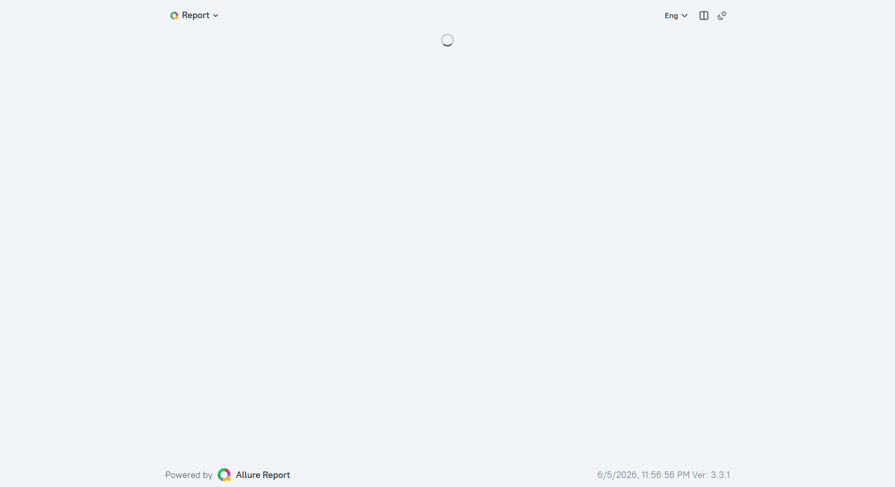

# Дипломный проект: автоматизация тестирования Trello

**Автор:** [shadow7971247](https://github.com/shadow7971247)  
**Объект:** [Trello](https://trello.com) — веб и Android-приложение Atlassian  
**Allure TestOps:** [проект #592](https://allure.autotests.cloud) · `shadow7971247_trello`

Экосистема **API-first**: API готовит данные, UI проверяет публичный веб, mobile — native-приложение на эмуляторе и в BrowserStack.

---

## :link: Репозитории

| Репозиторий | Назначение | Тестов |
|-------------|------------|--------|
| **[trello](https://github.com/shadow7971247/trello)** (этот) | README, docs, media, CI | — |
| **[trello_api](https://github.com/shadow7971247/trello_api)** | REST CRUD, auth, data provider | 25 |
| **[trello_ui](https://github.com/shadow7971247/trello_ui)** | Read-only веб на публичных URL | 11 |
| **[trello_mobile](https://github.com/shadow7971247/trello_mobile)** | Appium: эмулятор + BrowserStack | 8 |

**Порядок прогона:** API → UI → Mobile.

---

## :open_file_folder: Структура рабочей папки

Локально все четыре репозитория лежат **рядом** в одной директории:

```
trello/                 ← вы здесь: документация, скрины, Jenkins
trello_api/             ← отдельный git-репозиторий
trello_ui/              ← отдельный git-репозиторий
trello_mobile/          ← отдельный git-репозиторий
```

Клонирование с нуля:

```powershell
.\scripts\clone_workspace.ps1 -Target C:\Projects
```

---

## :page_facing_up: Содержание

1. [Автотесты](#автотесты)
2. [Ручные кейсы](#ручные-кейсы)
3. [Технологии](#технологии)
4. [Установка](#установка)
5. [Запуск](#запуск)
6. [CI и TestOps](#ci-и-testops)
7. [Скриншоты](#скриншоты)
8. [Документация](#документация)

---

## :test_tube: Автотесты

**Итого: 44 автотеста.**

### API — trello_api (25)

- ✅ Текущий пользователь по токену
- ✅ Невалидный токен
- ✅ Создание / получение / обновление / удаление доски
- ✅ Публичная доска
- ✅ Закрытие доски
- ✅ Создание доски без имени (негатив)
- ✅ Создание / получение / переименование списка
- ✅ Создание / получение / переименование / описание карточки
- ✅ Перенос карточки между списками
- ✅ Архивация и удаление карточки
- ✅ Чеклист и пункт чеклиста
- ✅ Доски и workspace участника
- ✅ Провижининг и очистка данных для UI

### UI — trello_ui (11)

- ✅ Открытие публичной доски по URL
- ✅ Открытие по shortUrl
- ✅ Заголовок доски во вкладке браузера
- ✅ Список на доске / несколько списков
- ✅ Карточка на доске / несколько карточек
- ✅ Архивная карточка не отображается
- ✅ Карточка по URL, ASCII-имя, ссылки на несколько карточек

### Mobile — trello_mobile (8)

- ✅ Активный package `com.trello`
- ✅ Экран досок после входа
- ✅ Deep link на доску из API
- ✅ Доска из API в списке / открытие
- ✅ Карточка с API на доске
- ✅ Переименование карточки (проверка через API)
- ✅ Удаление карточки (проверка через API)

---

## :clipboard: Ручные кейсы

См. [docs/MANUAL_TESTS.md](docs/MANUAL_TESTS.md) — 7 кейсов API / Web / Mobile / E2E, часть покрыта автотестами.

---

## :hammer_and_wrench: Технологии

| Python | Selenium | Pytest | Appium | Jenkins |
|--------|----------|--------|--------|---------|
|  |  |  |  |  |

| Allure | Requests | Pydantic | BrowserStack | Selenoid |
|--------|----------|----------|--------------|----------|
|  |  |  |  |  |

---

## :wrench: Установка

1. Клонировать репозитории (см. [clone_workspace.ps1](scripts/clone_workspace.ps1)).
2. В каждом проекте: `python -m venv .venv`, `pip install -r requirements.txt`.
3. Создать `trello_ui/.env` по `.env.example` — **API key и token** (для API и UI).
4. Для mobile: `trello_mobile/.env.local`, учётка Trello (`TRELLO_EMAIL`, `TRELLO_PASSWORD`).
5. Mobile локально: Appium `:4723`, эмулятор в `adb devices`.

---

## :arrow_forward: Запуск

```bash
# API
cd trello_api && pytest -m smoke --alluredir=allure-results

# UI
cd trello_ui && pytest -m ui --alluredir=allure-results

# Mobile — эмулятор
cd trello_mobile && pytest -m "mobile and not browserstack" --run-context local --alluredir=allure-results

# Mobile — BrowserStack
cd trello_mobile && pytest -m cloud_smoke --run-context browserstack --alluredir=allure-results

# Полный локальный прогон (PowerShell)
.\scripts\run_local_suite.ps1

# Отчёт
allure serve allure-results
```

### Результат локального прогона

| Проект | Маркер | Результат |
|--------|--------|-----------|
| trello_api | `smoke` | 7 passed |
| trello_ui | `ui` | 11 passed |
| trello_mobile | `mobile`, local | 6 passed |

---

## :gear: CI и TestOps

| Этап | Репозиторий | Команда |
|------|-------------|---------|
| API | `trello_api` | `pytest -m smoke --alluredir=allure-results` |
| UI | `trello_ui` | `pytest -m ui --alluredir=allure-results` |
| Mobile (облако) | `trello_mobile` | `pytest -m cloud_smoke --run-context browserstack` |

- **Jenkins:** Freestyle ([docs/JENKINS_FREESTYLE.md](docs/JENKINS_FREESTYLE.md)) или Pipeline ([Jenkinsfile](Jenkinsfile)).
- **TestOps:** `allurectl upload` → проект **#592**.

Прогоны трёх Jenkins-заданий (API, UI, Mobile) попадают в TestOps. Цепочка: запуск → suite → тест → шаг → вложение.

---

## :ticket: Скриншоты

### Allure — API, UI, Mobile





### UI — видео локального прогона

| Smoke (4 теста) | Полный suite (11 тестов) |
|-----------------|--------------------------|
| [ui_smoke_local.mp4](media/ui_smoke_local.mp4) (~8 с) | [ui_full_local.mp4](media/ui_full_local.mp4) (~24 с) |

Повторная запись: `trello_ui\.venv\Scripts\python.exe scripts\capture_ui_video.py` (локальный Chrome headless, без Selenoid/BrowserStack).

### UI — публичные доски

| Доска | Список | Карточка |
|-------|--------|----------|
|  |  |  |

### Mobile — эмулятор и сценарии

| Экран досок | Открытие доски | Deep link |
|-------------|----------------|-----------|
|  |  |  |

| Доска в списке | Rename | Delete |
|----------------|--------|--------|
|  |  |  |

> Слоты для скринов Jenkins и TestOps: добавьте `media/jenkins_build.png`, `media/testops_launch.png` перед защитой.

---

## :books: Документация

| Файл | Содержание |
|------|------------|
| [docs/CI.md](docs/CI.md) | Общий план CI |
| [docs/JENKINS_FREESTYLE.md](docs/JENKINS_FREESTYLE.md) | Freestyle job по шагам |
| [docs/MANUAL_TESTS.md](docs/MANUAL_TESTS.md) | Ручные кейсы |
| [Jenkinsfile](Jenkinsfile) | Pipeline (черновик) |
| [media/README.md](media/README.md) | Описание скриншотов |

---

## :white_check_mark: Итоги

- **44 автотеста**, три независимых репозитория, общий data layer через API.
- UI стабилен: публичные доски, без логина в браузере.
- Mobile: эмулятор и BrowserStack, скрины на каждом шаге Allure.
- CI: Jenkins → Allure TestOps #592.
