# Дипломный проект: автоматизация тестирования Trello

**Автор:** [shadow7971247](https://github.com/shadow7971247)  
**Объект:** [Trello](https://trello.com) — веб и Android-приложение Atlassian  
**Allure TestOps:** [проект #592](https://allure.autotests.cloud)  
**Jenkins:** [shadow7971247_trello_v2](https://jenkins.autotests.cloud/view/python_students/job/shadow7971247_trello_v2/) (папка `python_students`)

<h3>
<a href="https://github.com/shadow7971247/trello">trello</a> ·
<a href="https://github.com/shadow7971247/trello_api">trello_api</a> ·
<a href="https://github.com/shadow7971247/trello_ui">trello_ui</a> ·
<a href="https://github.com/shadow7971247/trello_mobile">trello_mobile</a>
</h3>

Проект демонстрирует **API-first** автоматизацию: REST API готовит и проверяет данные, UI-тесты работают с публичными досками без логина в браузере, mobile-тесты — через Appium на эмуляторе и в BrowserStack App Automate.

---

## Репозитории

| Репозиторий | Назначение | Автотестов |
|-------------|------------|------------|
| **[trello](https://github.com/shadow7971247/trello)** (этот) | README, docs, media, CI | — |
| **[trello_api](https://github.com/shadow7971247/trello_api)** | REST CRUD, auth, data provider | 25 |
| **[trello_ui](https://github.com/shadow7971247/trello_ui)** | Read-only веб на публичных URL | 11 |
| **[trello_mobile](https://github.com/shadow7971247/trello_mobile)** | Appium: эмулятор + BrowserStack | 10 |

**Итого в кодовой базе: 46 автотестов.**  
**В CI (набор `all`): 21 тест** — API smoke (7) + UI (11) + Mobile cloud smoke (3).  
**В Allure TestOps #592: 24 тест-кейса** — 21 автоматизированных + 3 ручных (покрытие автоматизации **87,5%**).

**Порядок прогона в Jenkins:** API → UI → Mobile.

---

## Архитектура

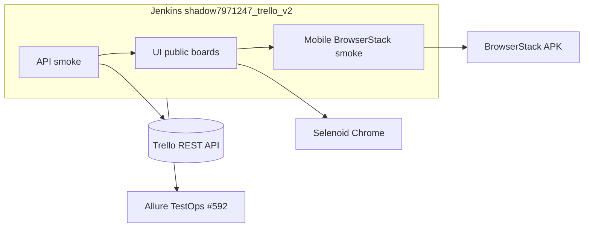

| Слой | Инструмент | Где запускается |
|------|------------|-----------------|
| API | `requests`, Pydantic | Jenkins / локально |
| UI | Selenium, Selene | Jenkins (Selenoid) / локально (Chrome) |
| Mobile | Appium, UiAutomator2 | Jenkins (BrowserStack) / локально (эмулятор) |

---

## Структура рабочей папки

```
trello/                 ← документация, media, Jenkins
trello_api/             ← отдельный git-репозиторий
trello_ui/              ← отдельный git-репозиторий
trello_mobile/          ← отдельный git-репозиторий
```

Клонирование:

```powershell
.\scripts\clone_workspace.ps1 -Target C:\Projects
```

---

## Содержание

1. [Автотесты](#автотесты)
2. [Ручные кейсы](#ручные-кейсы)
3. [Технологии](#технологии)
4. [Установка и запуск](#установка-и-запуск)
5. [CI: Jenkins и TestOps](#ci-jenkins-и-testops)
6. [Скриншоты и записи](#скриншоты-и-записи)

---

## Автотесты

### API — trello_api (25)

Smoke в CI (7): текущий пользователь, невалидный токен, CRUD доски, публичная доска, список, карточка, чек-лист.

Полный набор: CRUD досок / списков / карточек, архивация, негативные кейсы, workspace участника, провижининг данных для UI.

### UI — trello_ui (11)

Публичные доски без авторизации: открытие по URL и shortUrl, списки и карточки, архивная карточка скрыта, ссылки `/c/`, ASCII-имена.

### Mobile — trello_mobile (10)

**BrowserStack CI (3):** активный package, welcome-экран, повторный `activate_app`.

**Локальный эмулятор (7):** smoke (экран досок, deep link), доска/карточка из API, открытие доски, rename/delete с проверкой через API.

---

## Ручные кейсы

См. [docs/MANUAL_TESTS.md](docs/MANUAL_TESTS.md) — 7 описанных сценариев API / Web / Mobile / E2E; часть дублируется автотестами.

В **Allure TestOps** заведены **3 manual test case** (иконка «рука» в списке кейсов):

| ID | Название | Слой |
|----|----------|------|
| #44838 | Вход в Trello через браузер | Web |
| #44839 | Создание доски через UI | Web |
| #44840 | Выход из аккаунта | Web |

Эти сценарии требуют авторизации в браузере и не входят в автоматический прогон Jenkins; их можно прогонять отдельным **Manual launch** в TestOps.

---

## Технологии

| Python | Selenium | Pytest | Appium | Jenkins |
|--------|----------|--------|--------|---------|
|  |  |  |  |  |

| Allure | Requests | Pydantic | BrowserStack | Selenoid |
|--------|----------|----------|--------------|----------|
|  |  |  |  | 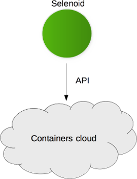 |

---

## Установка и запуск

1. Клонировать репозитории ([clone_workspace.ps1](scripts/clone_workspace.ps1)).
2. В каждом проекте: `python -m venv .venv`, `pip install -r requirements.txt`.
3. `trello_ui/.env` — `TRELLO_API_KEY`, `TRELLO_API_TOKEN`; для mobile также `TRELLO_EMAIL`, `TRELLO_PASSWORD`.
4. Mobile локально: Appium `:4723`, эмулятор в `adb devices`, `trello_mobile/.env`.

```bash
# API
cd trello_api && pytest -m smoke --alluredir=allure-results

# UI
cd trello_ui && pytest -m ui --alluredir=allure-results

# Mobile — эмулятор
cd trello_mobile && pytest -m "mobile and local_only" --run-context local --alluredir=allure-results

# Mobile — BrowserStack
cd trello_mobile && pytest -m cloud_smoke --run-context browserstack --alluredir=allure-results

# Полный локальный прогон
.\scripts\run_local_suite.ps1

# Allure локально
allure serve allure-results
```

### Результаты локального прогона

| Проект | Маркер | Результат |
|--------|--------|-----------|
| trello_api | `smoke` | 7 passed |
| trello_ui | `ui` | 11 passed |
| trello_mobile | `local_only` | 7 passed |

---

## CI: Jenkins и TestOps

Freestyle job **[shadow7971247_trello_v2](https://jenkins.autotests.cloud/view/python_students/job/shadow7971247_trello_v2/)** (папка `python_students`):

| Действие | Ссылка |
|----------|--------|
| Запуск с параметрами | [Build with Parameters](https://jenkins.autotests.cloud/view/python_students/job/shadow7971247_trello_v2/build?delay=0sec) |
| Статус и история сборок | [Job dashboard](https://jenkins.autotests.cloud/view/python_students/job/shadow7971247_trello_v2/) |

| Параметр `test_suite` | Что запускается |
|----------------------|-----------------|
| `all` | API smoke + UI + Mobile BrowserStack (21 тест) |
| `api` | 7 smoke API |
| `ui` | 11 UI |
| `mobile` | 3 cloud smoke |

Артефакты: `allure-report.zip`, загрузка в **Allure TestOps #592** через `allurectl`.

Подробнее: [docs/JENKINS_FREESTYLE.md](docs/JENKINS_FREESTYLE.md), [docs/CI.md](docs/CI.md).

### Jenkins

*Выбор набора тестов перед запуском job.*

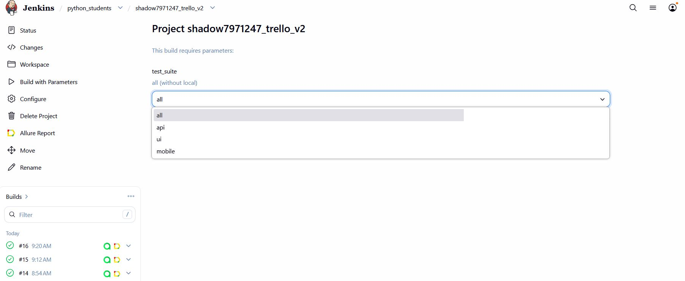

*Успешные сборки, артефакты Allure и тренд прохождения.*

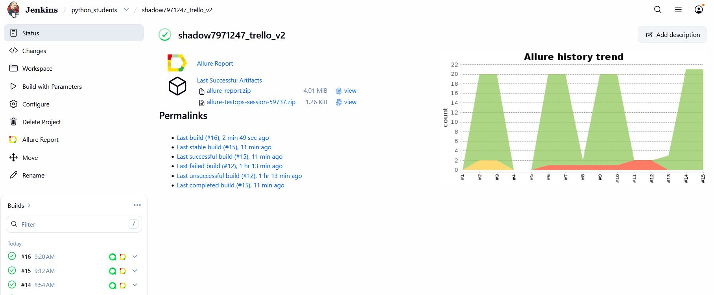

### Allure TestOps

*Дашборд проекта `trello_v2`: 24 активных кейса, покрытие автоматизации 87,5% (21 auto + 3 manual), тренд запусков.*

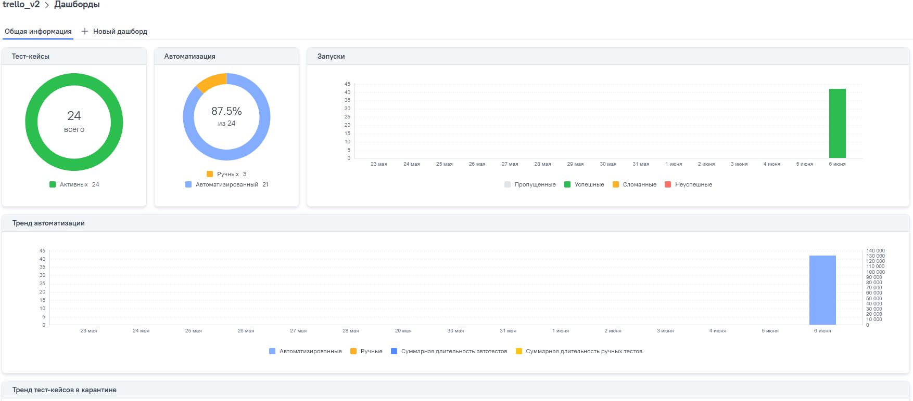

*Список тест-кейсов: автотесты с иконкой робота, ручные — с иконкой руки (#44838–#44840).*

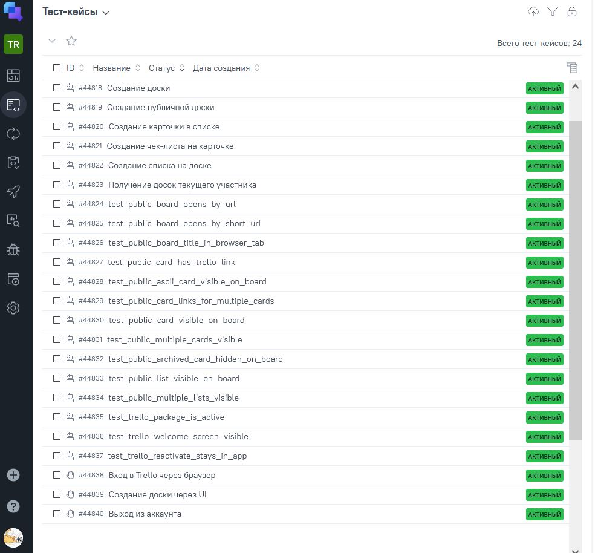

*Запуск Jenkins #17 в TestOps: 21 автотест (API + UI + Mobile smoke), все passed.*

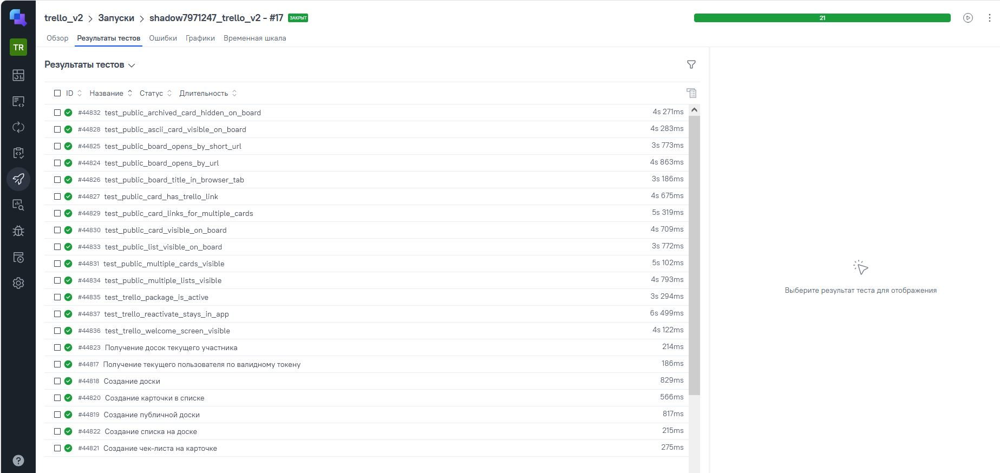

### Allure Report (артефакт Jenkins)

*Обзор отчёта Allure: 21 passed, ~2 мин, тренд по сборкам.*

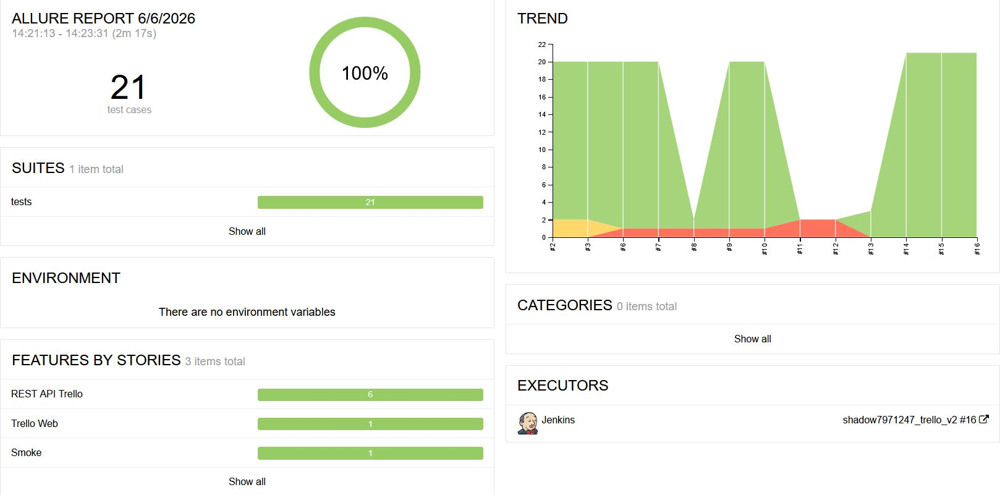

---

## Скриншоты и записи

### UI — публичные доски

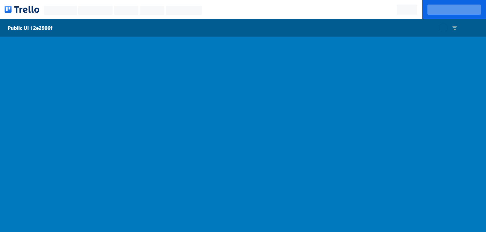

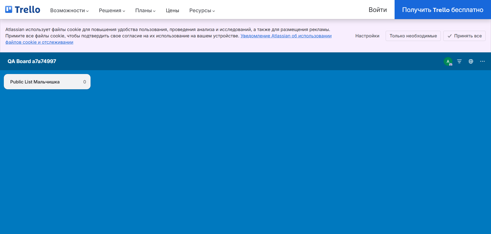

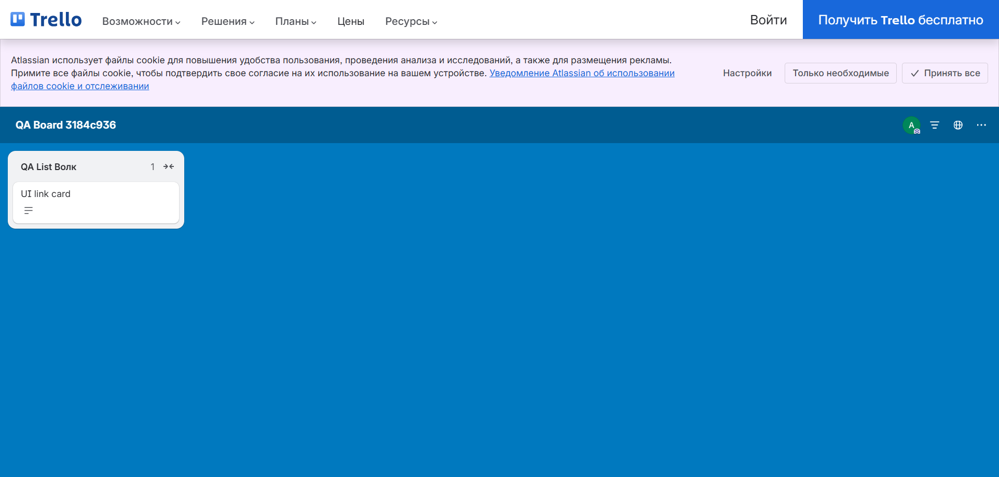

### Mobile — эмулятор

*GIF: локальный прогон mobile-тестов на Android-эмуляторе (Appium).*

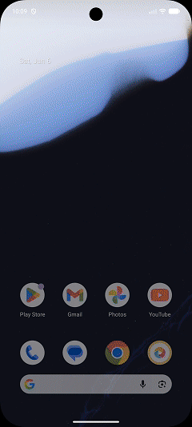

| Экран досок | Открытие доски | Deep link |
|-------------|----------------|-----------|
|  |  | 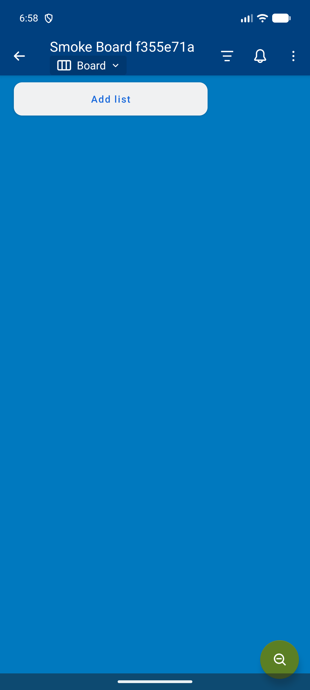 |

| Доска в списке | Rename | Delete |
|----------------|--------|--------|
| 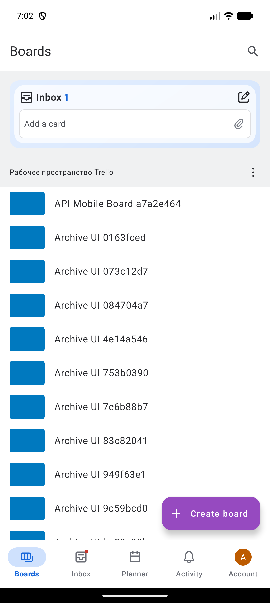 | 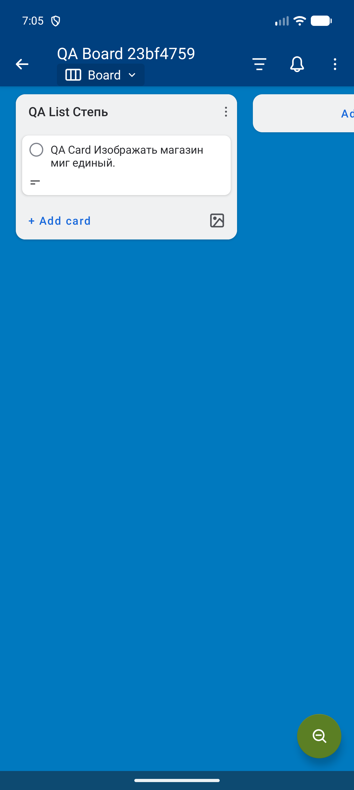 | 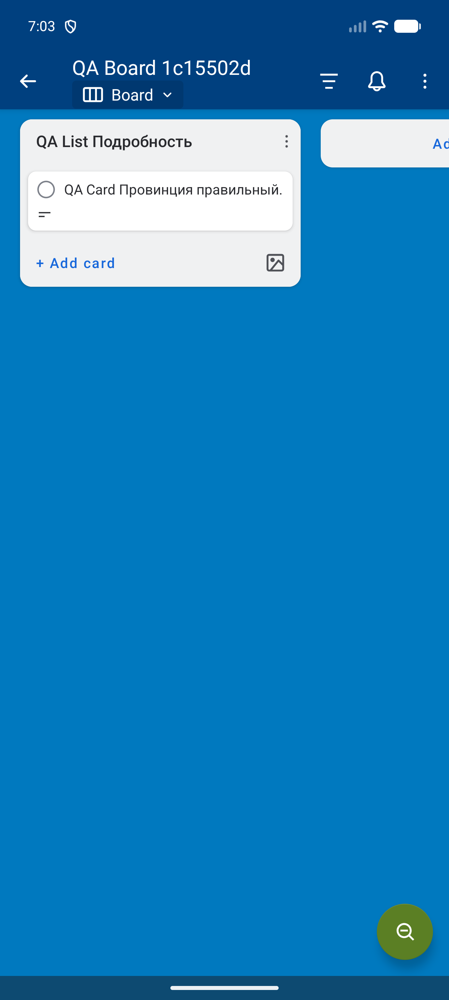 |

---

## Итоги

- **46 автотестов** в трёх репозиториях, общий data layer через Trello REST API.
- **3 ручных кейса** в TestOps (#44838–#44840) — сценарии с логином в браузере.
- **CI:** [Jenkins](https://jenkins.autotests.cloud/view/python_students/job/shadow7971247_trello_v2/) → Selenoid (UI) + BrowserStack (mobile smoke) → Allure TestOps #592.
- **TestOps:** 24 кейса, автоматизация 87,5%; Jenkins launch — 21 passed.
- **UI:** стабильные read-only сценарии на публичных досках.
- **Mobile:** полные E2E на эмуляторе; в CI — smoke без Atlassian OAuth.
- **Allure:** шаги на русском, термины CRUD / UI / API / Smoke без перевода.
