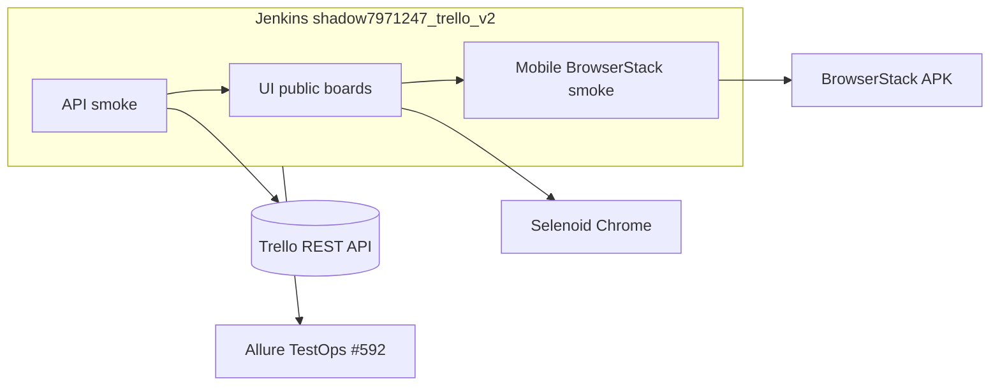
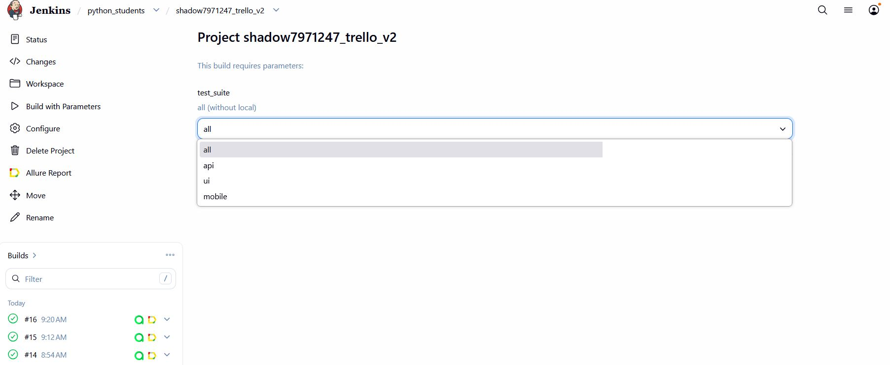
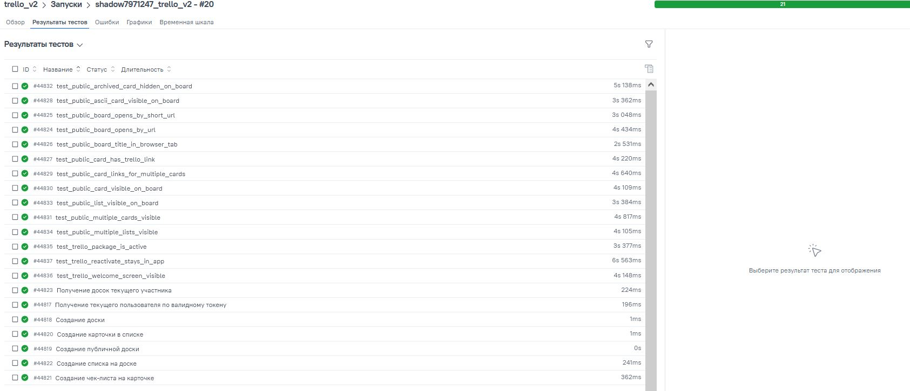
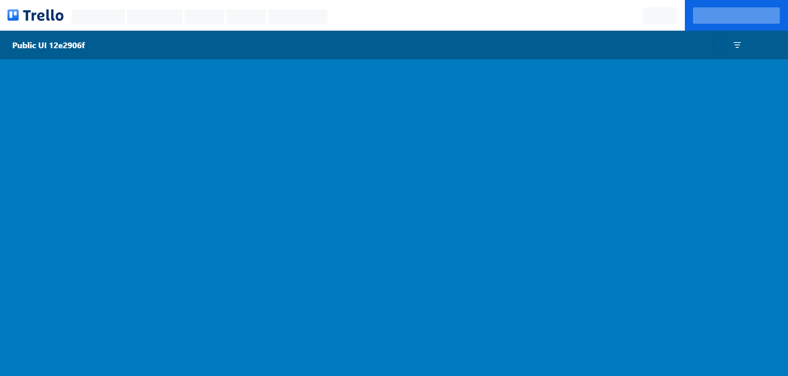
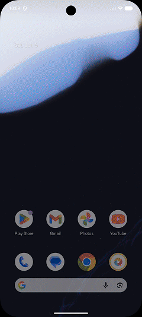
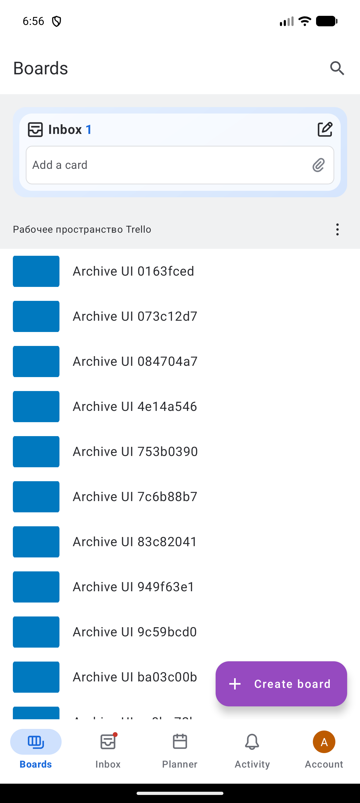
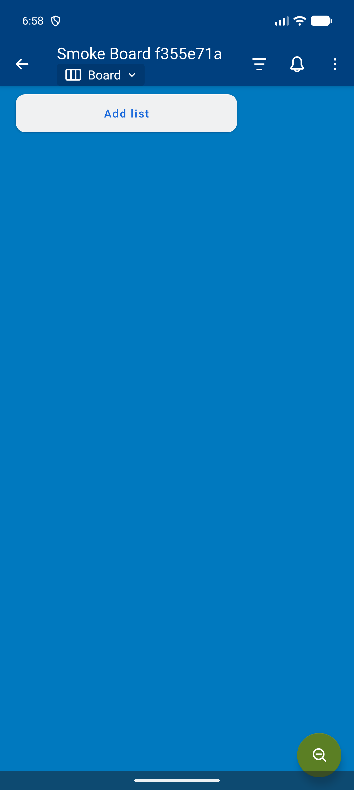
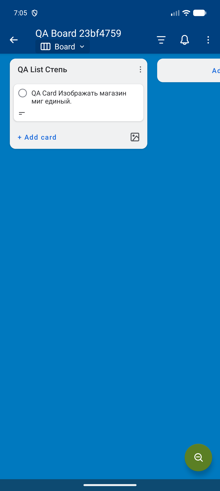

# Дипломный проект: автоматизация тестирования Trello

**Автор:** [shadow7971247](https://github.com/shadow7971247)  
**Объект:** [Trello](https://trello.com) — веб и Android-приложение Atlassian  
**Allure TestOps:** [проект #592](https://allure.autotests.cloud)  
**Jenkins:** [shadow7971247_trello_v2](https://jenkins.autotests.cloud/view/python_students/job/shadow7971247_trello_v2/) (папка `python_students`)

<h3>
<a href="https://github.com/shadow7971247/trello">trello</a> ·
<a href="https://github.com/shadow7971247/trello_api">trello_api</a> ·
<a href="https://github.com/shadow7971247/trello_ui">trello_ui</a> ·
<a href="https://github.com/shadow7971247/trello_mobile">trello_mobile</a>
</h3>

Проект демонстрирует **API-first** автоматизацию: REST API готовит и проверяет данные, UI-тесты работают с публичными досками без логина в браузере, mobile-тесты — через Appium на эмуляторе и в BrowserStack App Automate.

---

## Цель и задачи

**Цель:** автоматизировать проверку Trello на трёх слоях — REST API, веб (read-only) и Android-приложение — с единым data layer и CI.

**Задачи:**

1. CRUD и негативные сценарии Trello REST API (`trello_api`).
2. Read-only UI на публичных досках без логина в браузере (`trello_ui`).
3. E2E в mobile: smoke в BrowserStack CI + полный набор на эмуляторе (`trello_mobile`).
4. Jenkins → Allure TestOps, ручные кейсы для сценариев с авторизацией в браузере.

**Архитектура решения:** [docs/ARCHITECTURE.md](docs/ARCHITECTURE.md) (слои Business / Low Level / Page Object по модели Semenchenko & Kontyava).

---

## Репозитории

| Репозиторий | Назначение | Автотестов |
|-------------|------------|------------|
| **[trello](https://github.com/shadow7971247/trello)** (этот) | README, docs, media, CI | — |
| **[trello_api](https://github.com/shadow7971247/trello_api)** | REST CRUD, auth, data provider | 25 |
| **[trello_ui](https://github.com/shadow7971247/trello_ui)** | Read-only веб на публичных URL | 11 |
| **[trello_mobile](https://github.com/shadow7971247/trello_mobile)** | Appium: эмулятор + BrowserStack | 10 |

**Итого в кодовой базе: 46 автотестов.**  
**В CI (набор `all`): 21 тест** — API smoke (7) + UI (11) + Mobile cloud smoke (3).  
**В Allure TestOps #592: 24 тест-кейса** — 21 автоматизированных + 3 ручных (покрытие автоматизации **87,5%**).

**Порядок прогона в Jenkins:** API → UI → Mobile.

**Паттерны:** Page Object (UI), Screen Object (mobile), API-клиент по сущностям (boards / lists / cards).

---

## Схема CI


```mermaid
flowchart LR
  subgraph ci [Jenkins shadow7971247_trello_v2]
    A[API smoke] --> B[UI public boards]
    B --> C[Mobile BrowserStack smoke]
  end
  A --> D[(Trello REST API)]
  B --> E[Selenoid Chrome]
  C --> F[BrowserStack APK]
  ci --> G[Allure TestOps #592]
```

| Слой | Инструмент | Где запускается |
|------|------------|-----------------|
| API | `requests`, Pydantic | Jenkins / локально |
| UI | Selenium, Selene | Jenkins (Selenoid) / локально (Chrome) |
| Mobile | Appium, UiAutomator2 | Jenkins (BrowserStack) / локально (эмулятор) |

---

## Структура рабочей папки

```
trello/                 ← документация, media, Jenkins
trello_api/             ← отдельный git-репозиторий
trello_ui/              ← отдельный git-репозиторий
trello_mobile/          ← отдельный git-репозиторий
```

Клонирование:

```powershell
.\scripts\clone_workspace.ps1 -Target C:\Projects
```

---

## Содержание

1. [Матрица покрытия](#матрица-покрытия)
2. [Автотесты](#автотесты)
3. [Ручные кейсы](#ручные-кейсы)
4. [Технологии](#технологии)
5. [Установка и запуск](#установка-и-запуск)
6. [CI: Jenkins и TestOps](#ci-jenkins-и-testops)
7. [Скриншоты и записи](#скриншоты-и-записи)
8. [Troubleshooting](#troubleshooting)

---

## Матрица покрытия

| ID / кейс | Слой | Автотест / статус | Репозиторий |
|-----------|------|-------------------|-------------|
| M-API-01 | API | `test_create_board`, smoke CRUD | trello_api |
| M-WEB-01 | Web | `test_public_board_opens_by_url` | trello_ui |
| M-WEB-02 | Web | `test_public_card_visible_on_board`, card detail | trello_ui |
| M-MOB-01 | Mobile | `test_boards_tab_visible_when_logged_in` | trello_mobile |
| M-MOB-02 | Mobile | `test_api_board_opens_via_deep_link` | trello_mobile |
| M-MOB-03 | Mobile | `test_card_from_api_visible_on_board` | trello_mobile |
| M-INT-01 | E2E | API `prepare_*` → UI URL → mobile deep link | все три |
| #44838 | Web | **Manual** — вход через браузер | TestOps |
| #44839 | Web | **Manual** — создание доски через UI | TestOps |
| #44840 | Web | **Manual** — выход из аккаунта | TestOps |

Полный перечень ручных сценариев: [docs/MANUAL_TESTS.md](docs/MANUAL_TESTS.md).

**CI (`test_suite=all`):** 7 API smoke + 11 UI + 3 mobile cloud = **21 автотест**.  
**TestOps #592:** 24 кейса (21 auto + 3 manual) → покрытие автоматизации **87,5%**.

---

## Автотесты

### API — trello_api (25)

Smoke в CI (7): текущий пользователь, создание доски, публичная доска, список, карточка, чек-лист, доски участника.

Полный набор: CRUD досок / списков / карточек, архивация, негативные кейсы, workspace участника, провижининг данных для UI.

### UI — trello_ui (11)

Публичные доски без авторизации: открытие по URL и shortUrl, списки и карточки, архивная карточка скрыта, ссылки `/c/`, ASCII-имена.

### Mobile — trello_mobile (10)

**BrowserStack CI (3):** активный package, welcome-экран, повторный `activate_app`.

**Локальный эмулятор (7):** smoke (экран досок, deep link), доска/карточка из API, открытие доски, rename/delete с проверкой через API.

---

## Ручные кейсы

См. [docs/MANUAL_TESTS.md](docs/MANUAL_TESTS.md) — 7 описанных сценариев API / Web / Mobile / E2E; часть дублируется автотестами.

В **Allure TestOps** заведены **3 manual test case** (иконка «рука» в списке кейсов):

| ID | Название | Слой | Почему manual |
|----|----------|------|---------------|
| #44838 | Вход в Trello через браузер | Web | OAuth / логин в браузере, вне scope UI-автотестов |
| #44839 | Создание доски через UI | Web | Требует авторизованную сессию в веб-клиенте |
| #44840 | Выход из аккаунта | Web | Требует авторизованную сессию в веб-клиенте |

Эти сценарии требуют авторизации в браузере и не входят в автоматический прогон Jenkins; их можно прогонять отдельным **Manual launch** в TestOps.

---

## Технологии

| Категория | Инструменты |
|-----------|-------------|
| Язык / раннер | Python 3.12+, Pytest |
| API | Requests, Pydantic |
| UI | Selenium, Selene, Selenoid |
| Mobile | Appium, UiAutomator2, BrowserStack |
| Отчётность | Allure Report, Allure TestOps #592 |
| CI | Jenkins (`shadow7971247_trello_v2`) |

---

## Установка и запуск

1. Клонировать репозитории ([clone_workspace.ps1](scripts/clone_workspace.ps1)).
2. В каждом проекте: `python -m venv .venv`, `pip install -r requirements.txt`.
3. `trello_ui/.env` — `TRELLO_API_KEY`, `TRELLO_API_TOKEN`; для mobile также `TRELLO_EMAIL`, `TRELLO_PASSWORD`.
4. Mobile локально: Appium `:4723`, эмулятор в `adb devices`, `trello_mobile/.env`.

```bash
# API
cd trello_api && pytest -m smoke --alluredir=allure-results

# UI
cd trello_ui && pytest -m ui --alluredir=allure-results

# Mobile — эмулятор
cd trello_mobile && pytest -m "mobile and local_only" --run-context local --alluredir=allure-results

# Mobile — BrowserStack
cd trello_mobile && pytest -m cloud_smoke --run-context browserstack --alluredir=allure-results

# Полный локальный прогон
.\scripts\run_local_suite.ps1

# Allure локально
allure serve allure-results
```

### Результаты локального прогона

| Проект | Маркер | Результат |
|--------|--------|-----------|
| trello_api | `smoke` | 7 passed |
| trello_ui | `ui` | 11 passed |
| trello_mobile | `local_only` | 7 passed |

---

## CI: Jenkins и TestOps

Freestyle job **[shadow7971247_trello_v2](https://jenkins.autotests.cloud/view/python_students/job/shadow7971247_trello_v2/)** (папка `python_students`):

| Действие | Ссылка |
|----------|--------|
| Запуск с параметрами | [Build with Parameters](https://jenkins.autotests.cloud/view/python_students/job/shadow7971247_trello_v2/build?delay=0sec) |
| Статус и история сборок | [Job dashboard](https://jenkins.autotests.cloud/view/python_students/job/shadow7971247_trello_v2/) |

| Параметр `test_suite` | Что запускается |
|----------------------|-----------------|
| `all` | API smoke + UI + Mobile BrowserStack (21 тест) |
| `api` | 7 smoke API |
| `ui` | 11 UI |
| `mobile` | 3 cloud smoke |

Артефакты: `allure-report.zip`, загрузка в **Allure TestOps #592** через `allurectl`.

Подробнее: [docs/JENKINS_FREESTYLE.md](docs/JENKINS_FREESTYLE.md), [docs/CI.md](docs/CI.md), [docs/ARCHITECTURE.md](docs/ARCHITECTURE.md).

### Jenkins и TestOps

| Скрин | Описание |
|-------|----------|
|  | Build with Parameters |
|  | Launch в TestOps: 21 passed |

Остальные скрины: [Jenkins dashboard](https://jenkins.autotests.cloud/view/python_students/job/shadow7971247_trello_v2/), [TestOps #592](https://allure.autotests.cloud).

---

## Скриншоты и записи

### UI



### Mobile



| Экран досок | Deep link | Карточка |
|-------------|-----------|----------|
|  |  |  |

---

## Troubleshooting

| Симптом | Причина | Действие |
|---------|---------|----------|
| API `400 Workspaces are full` | Переполнен workspace Trello | Удалить старые тестовые доски в аккаунте |
| BrowserStack `app launch failed` | Несовместимый APK | Загрузить более старую сборку Trello, обновить `bs://` |
| UI не стартует в Jenkins | Selenoid | Задать `SELENOID_URL` одной переменной в job |
| Mobile локально | Appium / AVD | `appium -p 4723`, эмулятор в `adb devices` |

---

## Итоги

- **46 автотестов** в трёх репозиториях, общий data layer через Trello REST API.
- **3 ручных кейса** в TestOps (#44838–#44840) — сценарии с логином в браузере.
- **CI:** [Jenkins](https://jenkins.autotests.cloud/view/python_students/job/shadow7971247_trello_v2/) → Selenoid (UI) + BrowserStack (mobile smoke) → Allure TestOps #592.
- **TestOps:** 24 кейса, автоматизация 87,5%; Jenkins launch — 21 passed.
- **UI:** стабильные read-only сценарии на публичных досках.
- **Mobile:** полные E2E на эмуляторе; в CI — smoke без Atlassian OAuth.
- **Allure:** шаги на русском, термины CRUD / UI / API / Smoke без перевода.
