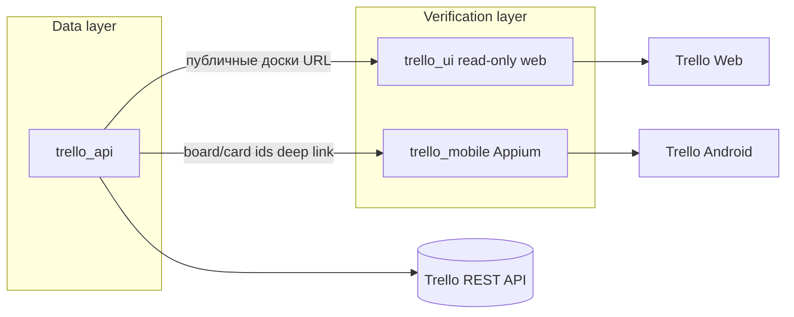
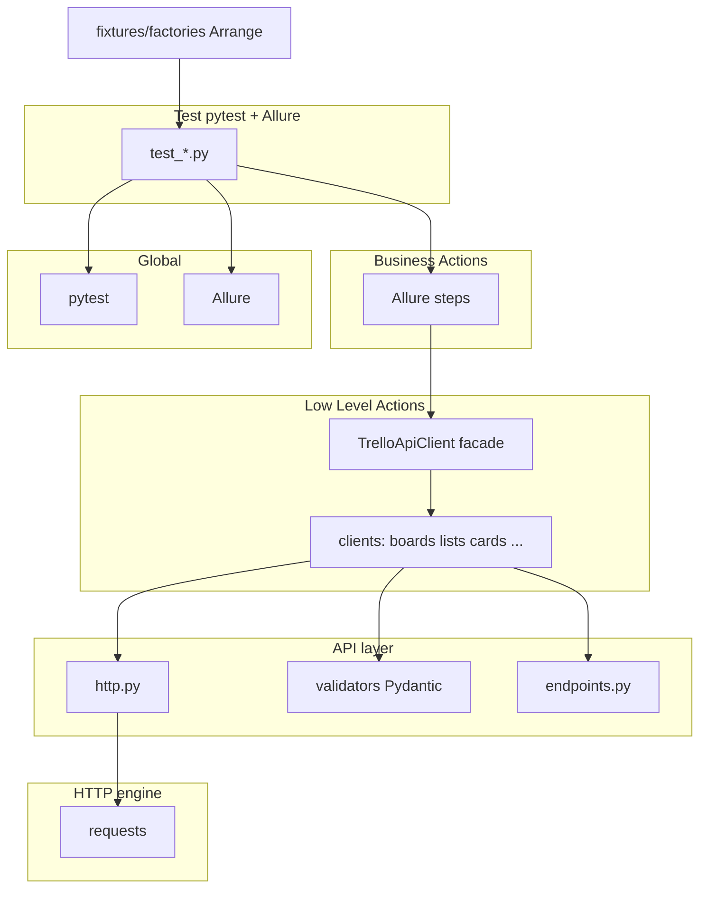
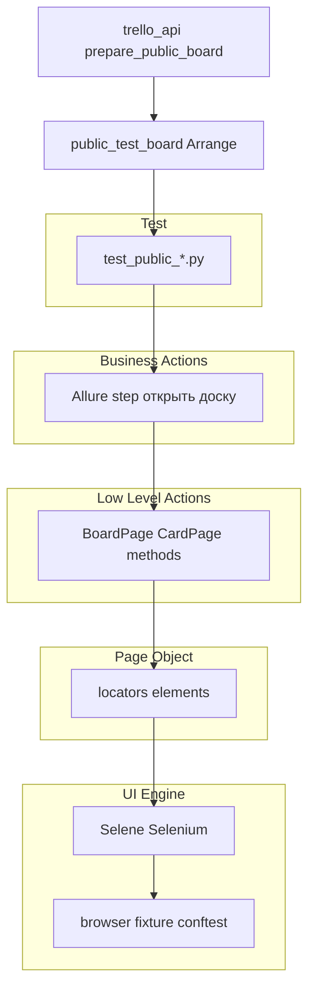
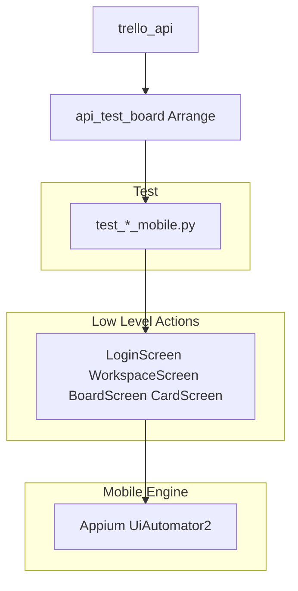

# Архитектура решения

Модель слоёв — **Business Actions → Low Level Actions → Page/Screen/API client** (Semenchenko & Kontyava, COMAQA).  
Схема CI (Jenkins, Selenoid, BrowserStack) описана отдельно в [CI.md](CI.md).

## Экосистема репозиториев

| Репозиторий | Роль | Паттерн |
|-------------|------|---------|
| **trello_api** | CRUD, auth, провижининг данных | API-клиент по сущностям |
| **trello_ui** | Read-only веб без логина | Page Object |
| **trello_mobile** | E2E в приложении | Screen Object |

---

## Правило 3A (Arrange — Act — Assert)

| Фаза | Где реализовано | Пример |
|------|-----------------|--------|
| **Arrange** | Фикстуры с `yield`, `prepare_*` | `public_test_board`, `created_board` |
| **Act** | Вызов client / page / screen | `api_client.create_board()`, `BoardPage().open_by_url()` |
| **Assert** | Тест или `should_*` / `assert_equals` | `assert_status_code(response, 404)`, `should_have_board_title()` |

Проверки статус-кода и полей ответа **не** спрятаны внутри HTTP-слоя — они в тестах и клиентах через `assert_status_code` / `assert_equals`.

---

## API — trello_api

| Папка / модуль | Слой | Назначение |
|----------------|------|------------|
| `tests/` | Test | Сценарии, маркеры, Assert |
| `fixtures/factories.py` | Arrange | `prepare_board`, `prepare_public_board` |
| `fixtures/generators.py` | Arrange | Имена сущностей |
| `api/client.py` | Low Level | Фасад над клиентами |
| `clients/*` | Low Level | HTTP по сущности + проверка статуса |
| `api/http.py` | Engine | Запрос без auto-raise на 4xx |
| `api/validators.py` | PO | Pydantic-контракты |
| `models/` | PO | Request/response модели |
| `conftest.py` | Arrange | `app_config`, `api_client`, yield-фикстуры |

---

## UI — trello_ui

| Модуль | Назначение |
|--------|------------|
| `conftest.py` | Браузер, `api_client`, `public_test_board` (yield) |
| `pages/board_page.py`, `card_page.py` | Page Object |
| `ui_utils/screenshot.py` | `capture_step()` — скриншоты вне page |
| `config.py` | `UiConfig`, одна переменная `SELENOID_URL` |

---

## Mobile — trello_mobile

| Маркер | Где | Тестов |
|--------|-----|--------|
| `cloud_smoke` | Jenkins / BrowserStack | 3 |
| `local_only` | Локальный эмулятор | 7 |

---

## Global entities

| Компонент | Реализация |
|-----------|------------|
| Test Runner | pytest |
| Reporting | Allure Report + Allure TestOps #592 |
| Logging | `utils/logger.py` (API), browser log (UI) |
| CI orchestration | Jenkins job `shadow7971247_trello_v2` |

---

## Ссылки

- [Обзорный README](../README.md)
- [CI и Jenkins](CI.md)
- [Ручные кейсы](MANUAL_TESTS.md)
- Модель слоёв: доклад *«Архитектура решений автоматизации тестирования на уровне диаграмм»* (Semenchenko & Kontyava, COMAQA)
